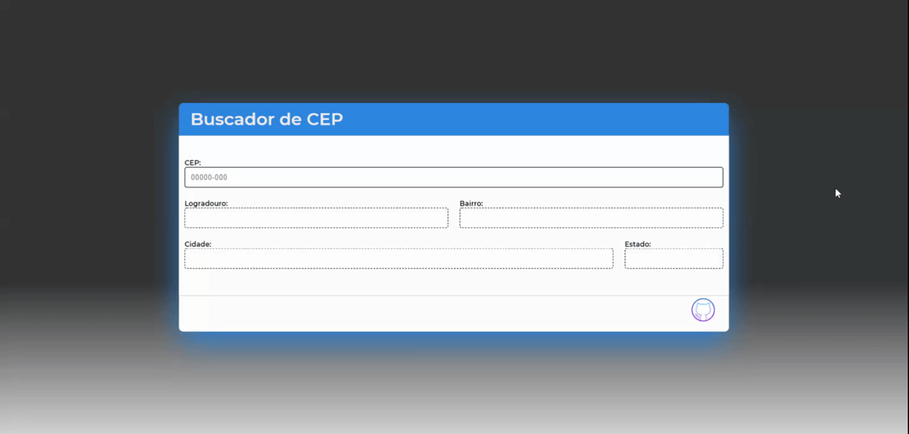

<h1 align="center"> CEP Search</h1>
<div align="center">
<h2 >Busca de CEP's de todo o Brasil - Utilizada a API da <a href="https://viacep.com.br/">ViaCep</a></h2>


 <h3> <a href="https://cep-search.henrfarias.vercel.app/">Demo</a> </h3>
</div>

## Visão geral / Overview


Este projeto foi feito com o intuito de aprender e testar o método 'XMLHttpRequest' de requisição do javascript, que promete atualizar informações da página sem precisar recarregá-la, este tipo de requisição é conhecida como **AJAX**. Para tal, utilizamos a API pública ViaCep como end point e seus recursos para validar se o CEP está referenciado na API. Além disso, o projeto também serviu para me familiarizar um pouco mais com o tratamento de dados e acredito ter compreendido muito bem este tipo de requisição. Portanto, vou explicar um pouco melhor as funcionalidades do projeto a seguir. 

---

## Como usar / How to use

- ### Primeiro, escreva no campo CEP o código que você deseja buscar. Pode utilizar o traço (-), sem problemas. Lembrando que o CEP é composto por 8 dígitos.


- ### Agora é só tirar o foco do campo, clicando em qualquer outro local da tela, tab ou enter, se preferir.

## Como funciona / How works

### Bem, a estrela do show é o 'XMLHttpRequest'. Então vamos lá:

<a href="https://developer.mozilla.org/pt-BR/docs/Web/API/XMLHttpRequest/Usando_XMLHttpRequest">**XMLHttpRequest** </a> - é um método especial (**constructor**). Por isso, precisamos instanciar o método em uma variável.


```js
  const req = new XMLHttpRequest();
```


    Com o construtor instanciado, agora precisamos montar nossa requisição, enviar e depois nos prepararmos para receber e trabalhar os dados da resposta.

---

### Montando a requisição req.open(HTTP Method, url, true)
    Nós montamos a requisição com o método .open que recebe alguns parâmetros, para este exemplo, vamos focar nestes três: 

    - HTTP Method (REST): Este é uma das coisas novas que aprendi. Este parâmetro é, basicamente, como o cliente vai interagir com os dados da rota. Quando ele quer retornar a requisição (resposta) do serviço com um conjunto de dados, utilizamos o método 'GET', que é nosso caso. Mas existem muitos outros métodos, como 'POST', 'PUT', 'DELETE'.

    - url: A ViaCep disponibiliza em sua documentação um passo a passo de o que fazer para acessar os dados da API. Para nossa funcionalidade, a url é formada com o valor extraído do campo CEP para completá-la. 
   
    - Async: Este dado é booleano e define se a requisição vai ser feita assíncronamente ( true ) com a aplicação ou não. O valor padrão é true. E assim deixamos.
  
  ```js
    url = `http://viacep.com.br/ws/${dadoExtraídoDoCampoCEP}/json/`    
  ``` 

### Preparado para as atualizações de estado da requisição 
    O XMLHttpRequest têm um método que funciona parecido com o .addEventListener do DOM, que é o onreadystatechange. Especificamente, esta função é acionada toda vez que o estado da requisição muda e vai de 0 até 4:
        0 --> UNSENT -->          open() não foi chamado ainda.
        1 --> OPENED -->          send() não foi chamado ainda.
        2 --> HEADER_RECEIVED --> send() foi chamado, cabeçalhos e status estão disponíveis.
        3 --> LOADING -->         Download dos dados --> responseText contém dados parciais.
        4 --> DONE -->            Operação concluída 

    Vamos começar a manipular os dados quando o estado for igual a 4. Ou seja: 

  ```js
    if (req.readyState === 4) {
      // Manipulando dados.
    }
  ```
### Enviando a requisição
    Para enviar a requisição é simples. Basta chamar o método .send: 
  ```js
    req.send();
  ```

### Manipulação dos dados
    O nome do construtor é XML... porém, não estamos presos á este tipo de dado, neste caso, por exemplo, optei por trabalhar com dados JSON. O ViaCep nos permite escolher o que desejamos receber. O próximo passo é trabalhar os dados recebidos, para isso utilizei a função JSON.parse para transformar a string JSON recebida em um objeto JS. Acessamos este conteúdo com a propriedade .responseText. Após isso, bastou atribuir os valores nos respectivos inputs (Poderia ter utilizado qualquer elemento html, apenas optei por input's).
    

No final, o código da request ficou assim:


```js
const req = new XMLHttpRequest();

    req.open('GET', url, true);

    req.onreadystatechange = () => {
      
      if (req.readyState === 4) {
        const json = JSON.parse(req.responseText);
        console.log(json);
        if(json.erro !== true) {
          pushCep(json);
          requestSuccesful();
        } else {
          spanDisplayed();
        }
      } 
    }
  
  req.send()
```
A função pushCep() expõe os dados recebidos na tela. As outras funções são apenas para feedback visual para o usuário. 

## Regras aplicadas
  - ### O campo CEP é o único input que aceita realmente receber dados.
  - ### O dado fornecido deve conter 8 dígitos (numéricos).
  - ### Traço ( - ) não impacta no resultado.
  - ### Se o valor fornecido conter caracteres alfa-numéricos, número de dígitos maior ou menor que 8 ou então um CEP inválido, a aplicação retorna um erro (Feedback visual).
  - ### A requisição é enviada quando o campo CEP perde o foco. Isso acontece quando clicamos em qualquer outro local da tela, quando clicamos a tecla TAB ou ENTER.
  - ### A requisição conta com uma indicação de carregamento no canto direito do campo de entrada do CEP.
  - ### Se a requisição é bem sucedida, há indicação visual.
  - ### Se ocorre algum problema durante a requisição, há indicação visual.

## Contact

- Linkedin [henrique-biasibetti](https://{your-web-site-link})
- GitHub [@henrfarias](https://github.com/henrfarias)

